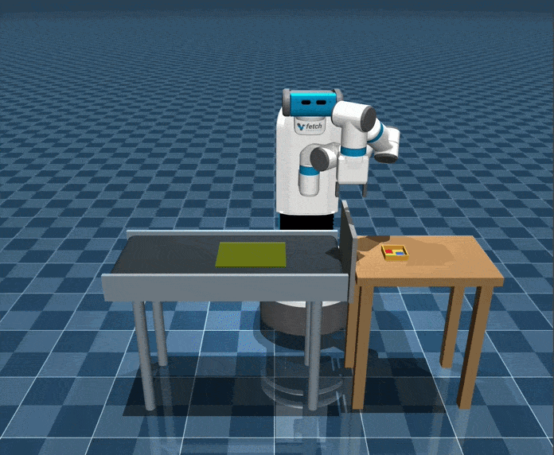

# COAD: Constant-Time Planning for Continuous Goal Manipulation with Compressed Library and Online Adaptation

Implementation of paper "COAD: Constant-Time Planning for Continuous Goal Manipulation with Compressed Library and Online Adaptation". This is a framework to provide constant-time solutions to goal-varying motion planning problems through a compressed library and fast online adaptation.

[Paper TBA] [[arXiv Preprint]](https://arxiv.org/abs/2603.12488) [[Presentation Video]](https://youtu.be/7beBnjVmmgk)


<p align="center">
    
    &nbsp;&nbsp;&nbsp;&nbsp;
    
</p>

## Dependency
This repository is developed with python 3.10.12 in Ubuntu 22.

#### Major python dependencies
```
pip install -r requirements.txt
```

#### OMPL
Install OMPL python bindings with provided pre-built wheels in [OMPL Github Releases](https://github.com/ompl/ompl/releases). This project uses OMPL 2.0.0.

#### Real-robot Deployment
If you want to run this with a real UR robot

```bash
pip install -r requirements_robot.txt
```


## Run this project

<p align="center">
    
</p>

### Build library

First discretize the workspace into a finite task set and solve IK for its joint
goals:

```bash
python coad/generate_task_set.py --env table --robot panda
python coad/generate_joint_goal_set.py --env table --robot panda --ik neighbor
```

#### Build a compressed library directly

The main COAD algorithm plans a new root path only when the existing roots cannot
be adapted to cover a task. It therefore builds the compressed library directly
from the joint-goal set, without first generating a full path library:

```bash
python coad/generate_condensed_task_paths.py \
  --env table --robot panda --ik neighbor \
  --planner RRTConnect --adaptation grr --n_neighbors 1000
```

Use `generate_condensed_task_paths_parallelized.py` with `--num_workers` for the
parallel implementation.

#### Build and condense a full library

This alternative first plans a path for every task and then compresses that saved
full library. Use it when benchmarking the `full` method or comparing direct
construction with post-hoc condensation:

```bash
python coad/generate_task_paths.py \
  --env table --robot panda --ik neighbor --planner RRTConnect

python coad/condense_task_paths.py \
  --env table --robot panda --ik neighbor \
  --planner RRTConnect --adaptation grr --n_neighbors 1000
```

### Comparison of Adaptation Methods

Here is a comparison among three methods in both real world and simulation. Overall:

- Linear Interpolation (LI) offers the fastest adaptation but results in an abrupt motion in the end. 

- Dynamic Motion Primitives (DMPs) adapts the root path globally and usually provides the best path quality, but failed to compress root path well in cluthered environment.

- Simple Trajectory Optimization (STO) can also transform the root path globally. It has better compression rate than DMPs and shorter path than LI. But it is sovled with convex optimization and is the slowest.

<br>

<table align="center">
  <tr>
    <td align="center">
      <br>
      Root Path
    </td>
    <td align="center">
      <br>
      LI adaptation
    </td>
  </tr>
</table>
<table align="center">
  <tr>
    <td align="center">
      <br>
      DMP adaptation
    </td>
    <td align="center">
      <br>
      STO adaptation
    </td>
  </tr>
</table>

Real World demonstrations:

<br>

<table align="center">
  <tr>
    <td align="center">
      <br>
      LI adaptation
    </td>
    <td align="center">
      <br>
      DMP adaptation
    </td>
    <td align="center">
      <br>
      STO adaptation
    </td>
  </tr>
</table>

### Benchmarking

Experiment entry points are organized by purpose:

| Task | Entry point |
| --- | --- |
| Adaptation performance and compression | `experiments/benchmark_adaptations.py` |
| Random-problem planning and baselines | `experiments/benchmark_planning.py` |
| Adaptation and planning summaries | `experiments/summarize_adaptations.py`, `experiments/summarize_planning.py` |
| Planning time and path-quality plots | `experiments/plot_planning.py` |
| Environment, goals, task regions, and paths | `experiments/visualize_*.py` |
| Moving conveyor pick-and-sort | `experiments/run_conveyor_experiment.py` |

#### Benchmark adaptation methods

This benchmark measures compression, adaptation success, online time, and path
length for the selected library methods:

```bash
python experiments/benchmark_adaptations.py \
  --robot panda --env table --methods grr opt dmp
```

Add `full` to `--methods` only after generating the full path library. To run
multiple configured robot-environment pairs, edit the arrays and settings at the
top of `run_adaptations.sh`, then run:

```bash
bash experiments/run_adaptations.sh
```

Set `generate_data=true` and `compress=true` in that script if it should also run
the full-library and post-hoc condensation pipeline before benchmarking.

#### Benchmark planning methods and baselines

This benchmark runs all selected methods on the same random planning queries:

```bash
python experiments/benchmark_planning.py \
  --robot fetch --env conveyor \
  --methods rrtc vamp lightning ertconnect \
  --samples 100 --timeout 3 --save-paths
```

For batch runs, edit the arrays and settings in `run_planning.sh`, then run:

```bash
bash experiments/run_planning.sh --save-paths
```

The supported planning methods are `full`, `grr`, `opt`, `dmp`, `linear`,
`rrtc`, `prmstar`, `vamp`, `lightning`, and `ertconnect`. Adaptation benchmarks
support `full` and the four adaptation methods. Only select optional baselines
whose dependencies are installed.

Summarize and plot saved results with:

```bash
python experiments/summarize_adaptations.py --robots panda fetch --envs table cage
python experiments/summarize_planning.py --robots panda fetch
python experiments/plot_planning.py --robots panda fetch --envs table cage --output-dir plots
```

Planning benchmarks must be run with `--save-paths` before their saved trajectories
can be replayed:

```bash
python experiments/visualize_env.py --env shelf --robot fetch
python experiments/visualize_goals.py --env shelf --robot panda
python experiments/visualize_tcr.py --env allstable --robot panda
python experiments/visualize_paths.py \
  --results data/baseline_results_panda_table.npz \
  --methods rrtc lightning --query 3
```

See [experiments/README.md](experiments/README.md) for dataset naming, output
formats, method-specific dependencies, conveyor execution, visualization options,
and regression tests.

For detailed analysis and comparison, please refer to our paper.
