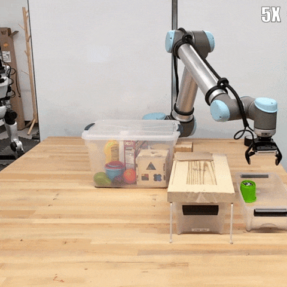
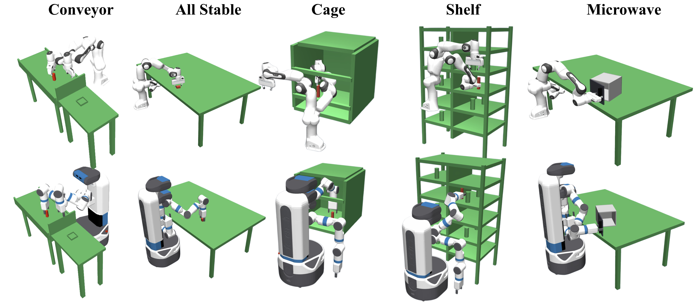
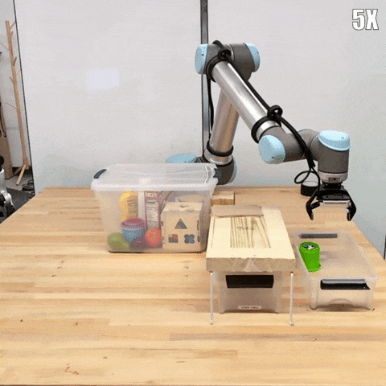
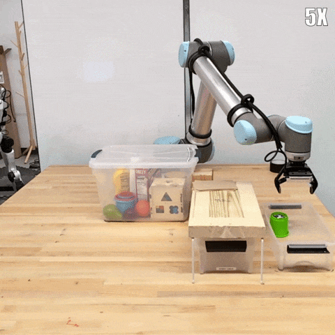
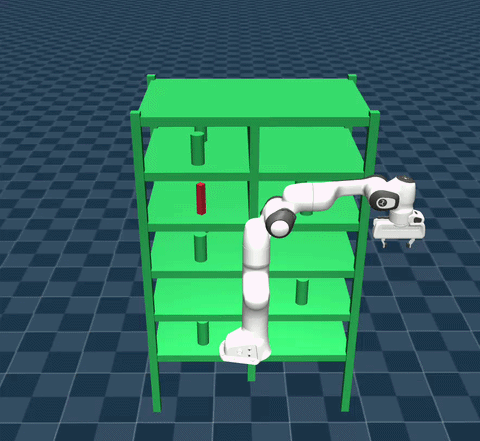
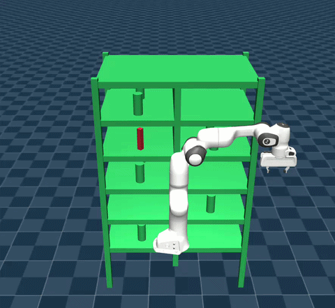

# COAD: Constant-Time Planning for Continuous Goal Manipulation with Compressed Library and Online Adaptation

Implementation of paper "COAD: Constant-Time Planning for Continuous Goal Manipulation with Compressed Library and Online Adaptation". This is a framework to provide constant-time solutions to goal-varying motion planning problems through a compressed library and fast online adaptation.

[Paper TBA] [[arXiv Preprint]](https://arxiv.org/abs/2603.12488) [Presentation Video TBA]

<p align="center">
    
    
</p>

<!-- <p align="center">
    <a href="https://youtu.be/">
        
    </a>
</p> -->


## Dependency
This repository is developed with python 3.10.12 in Ubuntu 22.

#### Major python dependencies
```
pip install -r requirements.txt
```

#### OMPL
Install OMPL python bindings with provided pre-built wheels in [OMPL Github Releases](https://github.com/ompl/ompl/releases). This project uses OMPL 1.7.0.

#### Real-robot Deployment
If you want to run this with a real UR robot

```bash
pip install -r requirements_robot.txt
```


## Run this project

<p align="center">
    
</p>

### Build library

Given a robot and an environment, we first need to discretize the workspace and acquire the finite task set from TCRs, then solve IK to acuiqre the joint goal set. For example:
```
python coad/generate_task_set.py --env table --robot panda
python coad/generate_joint_goal_set.py --env table --robot panda --ik neighbor
```

Then we can run one of the adaptation algorithms to build the compressed library. For example:
```
python coad/algorithm.py --env table --robot panda --ik neighbor --planner RRTConnect --adaptation grr
```

### Comparison of Adaptation Methods

Here is a comparison among three methods in both real world and simulation. Overall:
- Linear Interpolation (LI) offers the fastest adaptation but results in an abrupt motion in the end. 
- Dynamic Motion Primitives (DMPs) adapts the root path globally and usually provides the best path quality, but failed to compress root path well in cluthered environment.
- Simple Trajectory Optimization (STO) can also transform the root path globally. But it is sovled with convex optimization and is the slowest.

<br>

<table align="center">
  <tr>
    <td align="center">
      <br>
      LI adaptation
    </td>
    <td align="center">
      <br>
      DMP adaptation
    </td>
    <td align="center">
      <br>
      STO adaptation
    </td>
  </tr>
</table>

<br>

<table align="center">
  <tr>
    <td align="center">
      <br>
      Root Path
    </td>
    <td align="center">
      <br>
      LI adaptation
    </td>
  </tr>
</table>
<table align="center">
  <tr>
    <td align="center">
      <br>
      DMP adaptation
    </td>
    <td align="center">
      <br>
      STO adaptation
    </td>
  </tr>
</table>

### Benchmarking

To systematically analyze all the adaptation methods and compare with baseline methods, we can run benchmarking with these steps:

#### Generate solutions for CoAd

Run the bash files to generate solutions for all robot-environment pairs with all adaptaion methods:
```
bash experiment/run_experiments.sh
```

One can also run individual python file for each robot-environment pair:

- Discretize the entire workspace
    ```
    python coad/generate_task_set.py --env table --robot panda
    ```
- Generate joint goals from discretized TCRs
    ```
    python coad/generate_joint_goal_set.py --env table --robot panda --ik neighbor
    ```
- Generate a full-library from all the TCRs
    ```
    python coad/generate_task_paths.py --env table --robot panda --ik neighbor --planner RRTConnect
    ```
- Condense to get a compressed library from an adaptation method
    ```
    python coad/condense_task_paths.py --env table --robot panda --ik neighbor --planner RRTConnect --adaptation linear
    ```

#### Benchmark adaptation methods
```
python experiments/benchmark_adaptations.py
```

#### Benchmark with baselines
```
bash experiments/run_benchmarks.sh
```

For detailed analysis and comparison, please refer to our paper.
